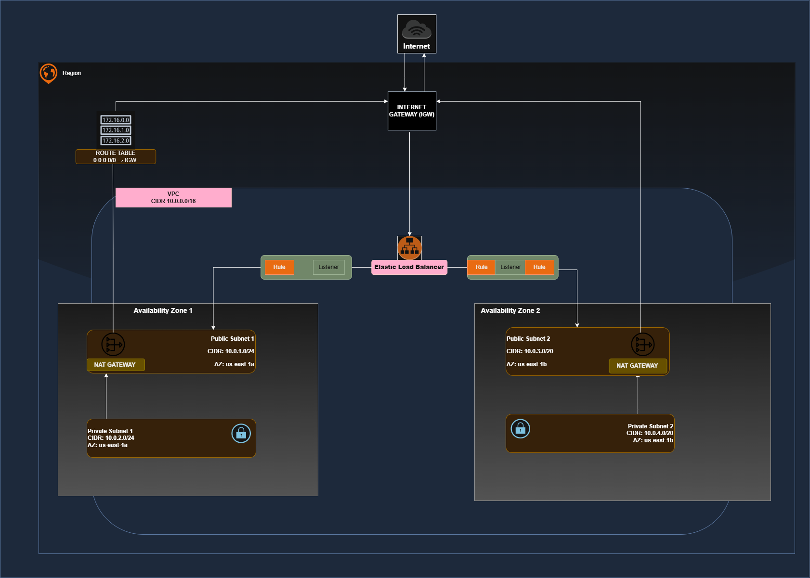
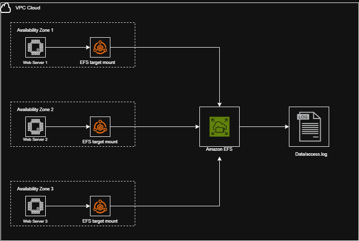
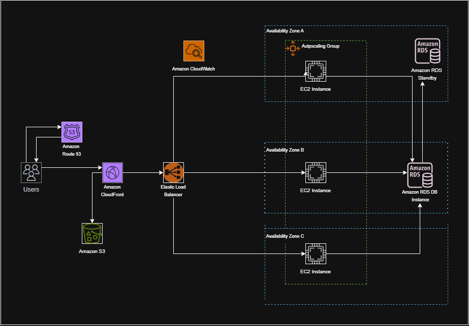
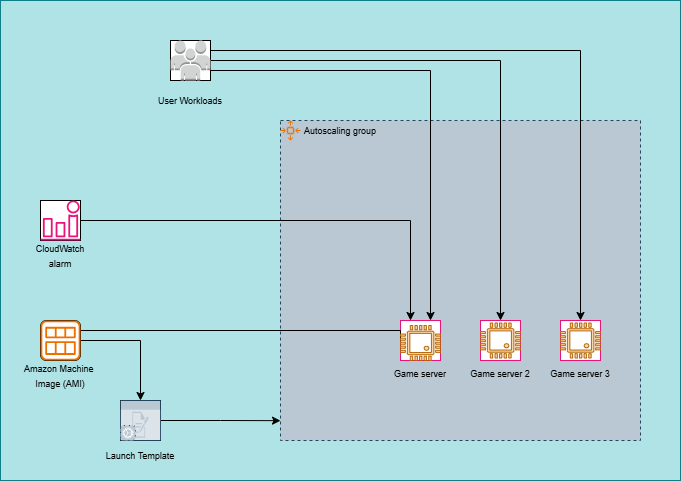
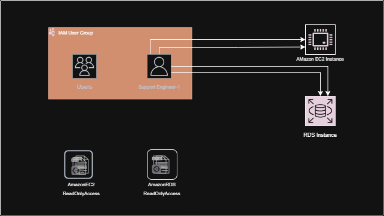
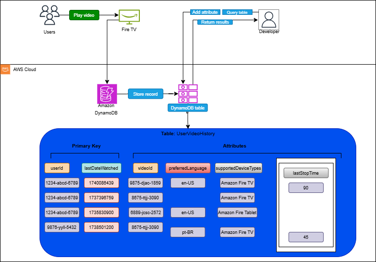
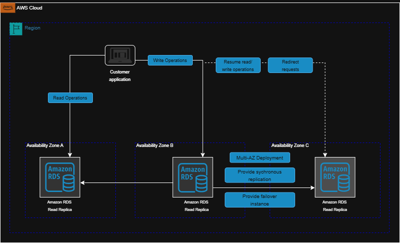
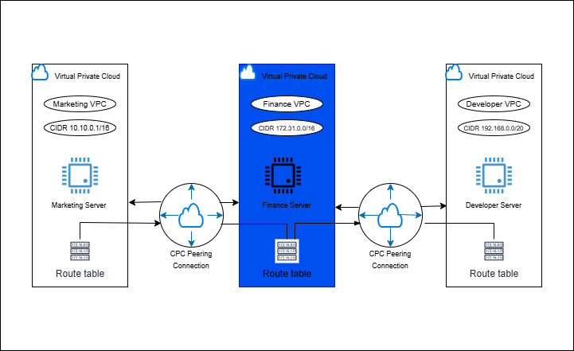
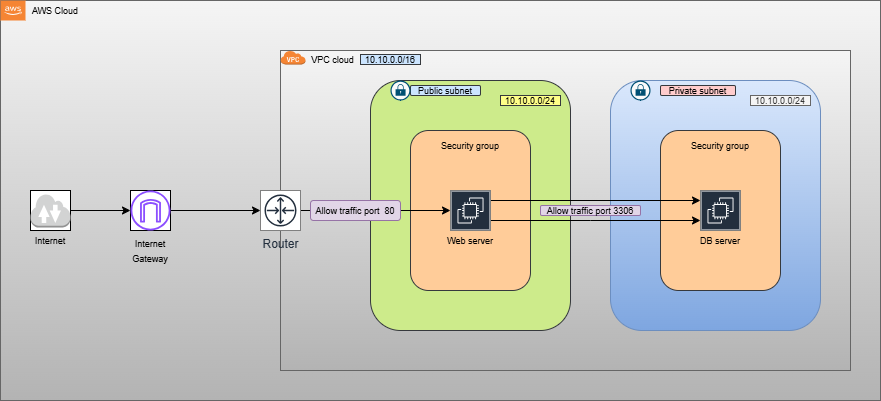
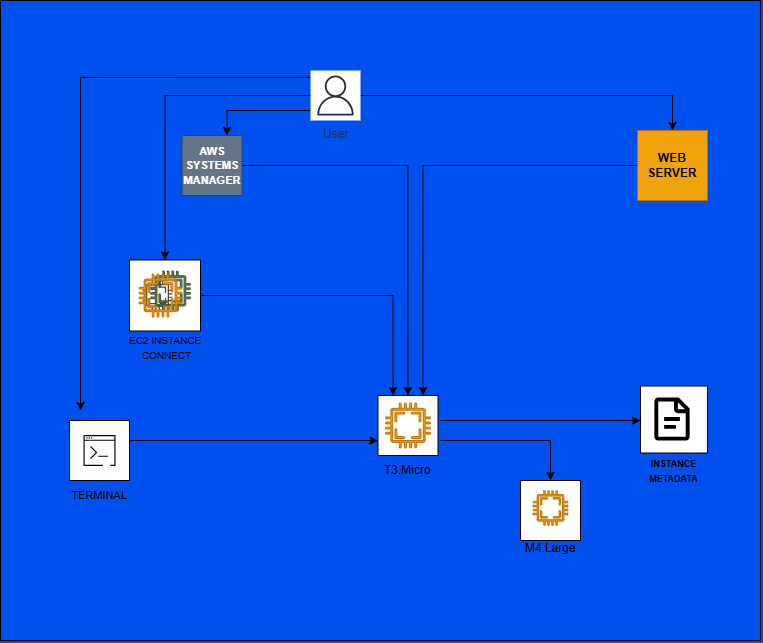

#  aws-cloud-infrastructure
# Enterprise-grade AWS infrastructure automation with Terraform - demonstrating cloud architecture patterns, resource provisioning, and IaC best practices. Highly Available Web Application Infrastructure (Terraform)

## Project Overview

This project provisions a highly available AWS networking foundation using Terraform as Infrastructure as Code (IaC).

It represents Phase 1 of a production-style, multi–Availability Zone web architecture designed following AWS best practices for scalability, fault tolerance, and network segmentation.

The objective of this phase is to establish a secure and extensible networking layer that will support application, load balancing, and database tiers in subsequent phases.

Architecture – Phase 1: Networking Foundation

This phase implements the core networking components required for a resilient cloud environment.

Region

us-east-1 (N. Virginia)

Resources Provisioned
1. Custom Virtual Private Cloud (VPC)

CIDR Block: 10.0.0.0/16

Provides logical isolation of cloud resources

Enables future subnet segmentation for multi-tier architecture

2. Public Subnets (Multi-AZ)

Two public subnets deployed across two Availability Zones

Designed to host internet-facing resources such as:

Application Load Balancers

Bastion Hosts (if required)

Public-facing services

3. Internet Gateway (IGW)

Attached to the VPC

Enables communication between VPC resources and the internet

4. Public Route Table

Associated with both public subnets

Includes route:

0.0.0.0/0 → Internet Gateway

5. Subnet Associations

Explicit subnet-to-route table associations

Ensures deterministic routing behavior

Aligns with infrastructure-as-code best practices

---

## The Architecture (Phase 1 – Networking Layer)

## All Tools Used

- Terraform >= 1.5
- AWS Provider ~> 5.0
- VS Code
- Git & GitHub

---

## 📂 Project Structure

##  AWS Hands-on architectural designs.

File Systems in the Cloud
Designed scalable shared storage solutions using:

Amazon Elastic File System
Distributed file storage for multi-instance environments

It demonstrates:

Shared storage architecture
State management across scaled compute layers

Amazon Bedrock Playground
I explored foundational AI services using:

Amazon Bedrock Playground

It demonstrates:

Familiarity with managed generative AI services
Understanding of integrating AI capabilities into cloud-native applications

Highly Available Web Applications

I designed multi-tier architecture:

Internet
→ Load Balancer
→ Private EC2
→ Multi-AZ Database

It demonstrates:

Multi-AZ fault tolerance
Proper public/private resource placement
End-to-end production architecture design

Auto-Healing and Scaling Applications

Built resilient application layers using:

Auto Scaling Groups
Health checks
Load balancer target groups

It demonstrates:

Self-healing infrastructure
Elastic scaling design

Core Security Concepts (IAM Least Privilege)

I applied security best practices using:

AWS Identity and Access Management
Role-based access control
Instance profiles for EC2
Least privilege policies

It demonstrates:

Secure cloud identity architecture
Principle of least privilege implementation

First NoSQL Database (DynamoDB)

I designed scalable NoSQL solutions using:

Amazon DynamoDB
Partition key design
High throughput configuration

It demonstrates:

Understanding of NoSQL data modeling
Fully managed serverless database architecture

Databases in Practice (Amazon RDS Multi-AZ)

I implemented highly available relational database architecture using:

Amazon RDS with Multi-AZ deployment
DB Subnet Groups in private subnets
Security group isolation

It demonstrates:

Data layer resilience
Automatic failover configuration
Secure database access patterns

Cloud Economics

I evaluated architectural cost considerations including:

On-demand vs Reserved Instances
NAT Gateway cost implications
Multi-AZ trade-offs
Scaling vs fixed-capacity compute

It demonstrates:

Cost-aware architectural decision making
Balancing availability with financial efficiency

### Connecting VPCs (VPC Peering)

I designed inter-VPC communication using:

VPC Peering connections
Route table updates for bidirectional traffic
Controlled CIDR planning to prevent overlap

It demonstrates:

Multi-environment architecture
Cross-network communication strategy
Cloud network topology design

Networking Concepts (VPC Configuration)

I designed a custom VPC architecture including:

Public & Private subnets across multiple AZs
Internet Gateway configuration
NAT Gateway per Availability Zone
Route tables & subnet associations

It demonstrates:

Network segmentation
Secure traffic flow design
High availability at the network layer

Computing Solutions (EC2 Scaling)

Description:
Scaled EC2 instance capacity by upgrading instance type to improve application performance and support increased workload demands.

### Computing Solutions

I designed and deployed scalable EC2-based application environments using:

Launch Templates
Auto Scaling Groups
Application Load Balancers
Multi-AZ deployment strategies

It demonstrates:

Horizontal scaling
Health checks & instance replacement
Production-ready compute layer design

These designs collectively demonstrate hands-on experience in architecting scalable, secure, and highly available cloud solutions following AWS best practices and the Well-Architected Framework principles.